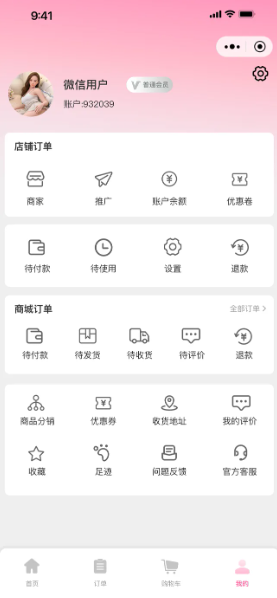

# shared-space-frontend

蜜桃成人馆是一个共享空间类型的成人馆，本项目只是小程序端。

## 系统组成
系统主要包括运营管理端和用户端。

## 用户端功能
1. **定位查看**：定位查看本市的成人馆列表。
2. **详情查看**：查看成人馆的详情，包括成人馆的简介、地图位置等。
3. **套餐详情**：查看成人馆的套餐详情，包括娃娃图片和房间布局、套餐价格等。
4. **套餐购买**：购买套餐。
5. **时段预约**：根据购买的套餐预约具体成人馆的时间段，预约时需要交押金。
6. **开门使用**：预约成功后，在预约时间内可开门使用成人馆。
7. **押金退回**：使用结束后提醒保洁人员，保洁完成后押金退回。

## 其他功能
1. **分销加盟**：分销和加盟功能。
2. **商城下单**：商城功能，可下单娃娃或其他成人商品，快递配送。
3. **系统结合**：本系统实际使用需结合智能门锁、智能网关、多路电源控制系统（可小程序远程开门（或一次性密码开门）、播放声音、控制多路电源等）。

## 系统特点及咨询方式
本系统功能完善，可直接商用，也可定制化开发。我们是专业的,有路子有想法的我们聊聊吧:  awfqqqyad@outlook.com

# ----------示例图片----------------

